# 面向PPT的自控复习

复习资料：PPT 自控英文书 自控中文书

第一次尝试面向PPT复习，主要思路是以PPT为骨架，然后用书籍、资料和练习进行血肉的补充。

重点会使用引用的形式标出来

## 1

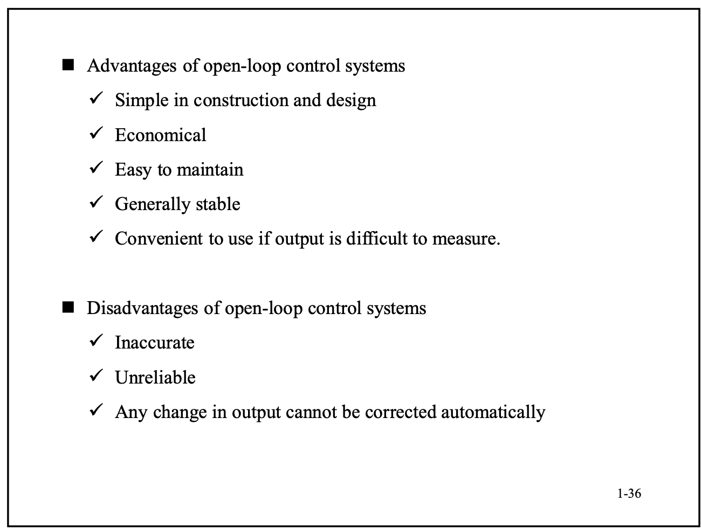

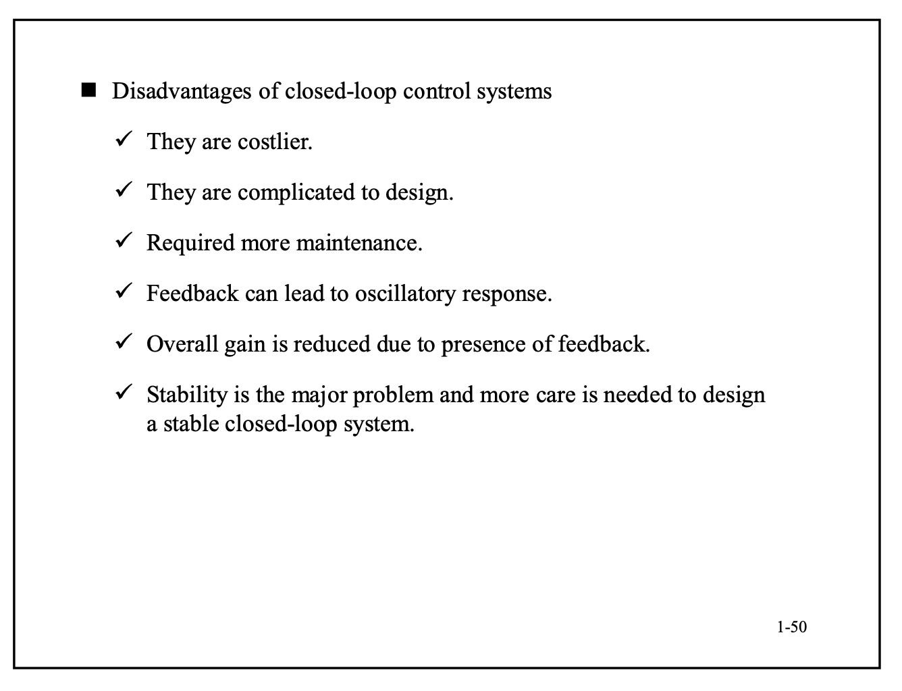

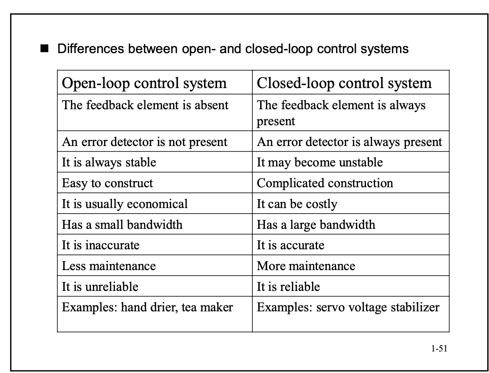

Controller sensor actuator ref

## 3 

## 7 The Root Locus Method

### 7.1 What is a Root Locus

回忆一下特征方程，特征方程只在闭环中出现。这里的特征方程是默认反馈的增益为1的。

特征方程: $1 + KG(s) = 0$

注意，K始终为自然数

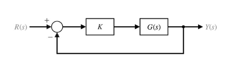

Root locus方法是画出在K变化时的根轨迹。根指的就是闭环极点。

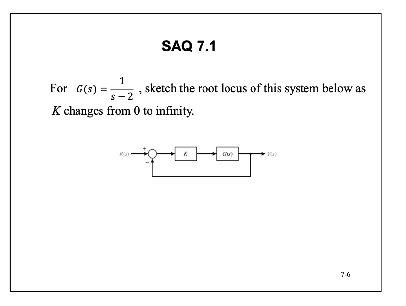

画出来是一条直线

### 7.2 Root locus Procedure

---

步骤一：解特征方程

根轨迹本质上是在解方程，所以首先列出特征方程，根据特征方程做文章。

以下是第一个步骤

1. $1 + KG(s) = 0$
   - $G(s)$ 分解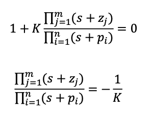
   - 在图中画出零点和极点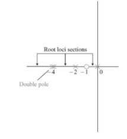
     - 零点画o 极点画x
   - 画出separate loci
     - 从n个极点画到到m个零点，其他的点直接飞走，飞到无穷
     - 所以有(n-m)个branches
   - the root loci are symmetrical with respect to the horizontal real axis
     - 这是由于在分解传递函数的时候复数根总是成对出现。可以想一想初中解二次方程的时候，那个正负根号4ab是虚数项。**事实上，实高次方程总可以拆成根相乘的形式，没有实数解的总会由两个共轭复数解凑出来**

$ G(s) $ 是开环传递函数，所以有零点和极点。根据回忆，零点和极点都是由于拉普拉斯方程中微分和积分项的存在，所以我们是在根据开环的方程来描述闭环的表现。如何保证开环和闭环是单映射呢？我们其实简化了方程

**那对于那些反馈不是常函数的系统呢？**

在K趋向于0的时候，只有极点会起作用；在K趋向于$\infty$ 的时候，只有零点会起作用。所以在画根轨迹法的时候，总是由极点画到零点。这点非常重要，似乎是一个趋势。

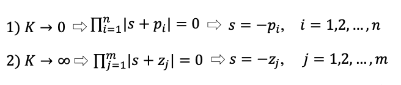

---

步骤2：实数轴连点成线

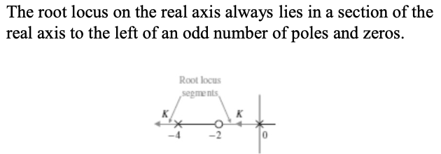

这个情况我觉得是假设有实数根的情况下一定符合，但是仍然是有很多问题的。

**第一，假如很多极点连续的排列在实轴上呢**

**第二，为什么一定是往负方向走？** 

---

步骤3: 渐进线

由步骤1可以看出，渐进线是由于飞走的branch产生的。所有的渐进线都交于实数轴上的一个点。

**为啥是一个点？** 

这个点是
$$
\sigma_{a} = \frac{\sum^n_{i=1}(-p_i)-\sum^m_{j=1}(-z_j)}{n-m}
$$
注意符号，带负号的才是零点和极点。还有是极点减去零点，就跟分母一样，因为分母总是比分子高次。

一个点分出来了很多条渐进线，公式是
$$
\theta_a = \frac{(2k+1)\pi}{n-m}\\
k = 0,1,2...(n-m-1)
$$

把n-m带入这个公式，会发现很有意思的事情。在n-m=0的时候没有意义。大于1的时候总会有渐进线走向实负轴。然后剩下的事实上是在平分这个平面。

这个时候PPT展示了一张狗屎推导。

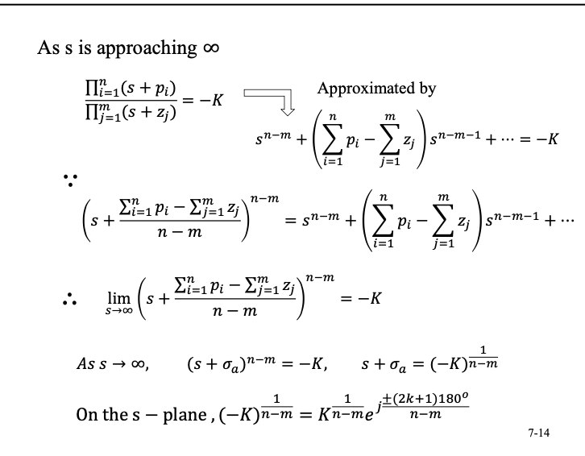

事实上是这俩公式的推导，可看可不看。

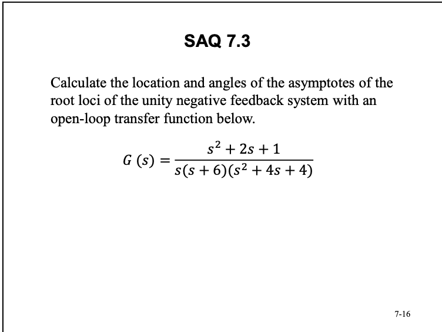

---

步骤4: 确定locus路过虚轴上的点

乱飞的branch有时会碰到虚轴，我们为什么要确定虚轴上的点呢，因为这是稳定性的阈值。

本质上也是在解特征方程，然后把$s$全部替换为$j\omega$

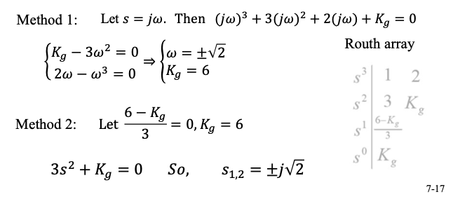

---

步骤5: determine the breakaway point on the real axis

刚刚确定了渐进线的交点，但是真正的locus是在哪里分离的呢，就是breakaway point。

还是解特征方程，把K写作s的方程

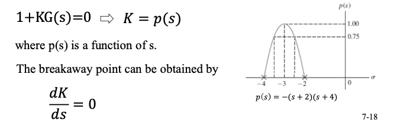

然后导数为0，就可以得到分离点了。

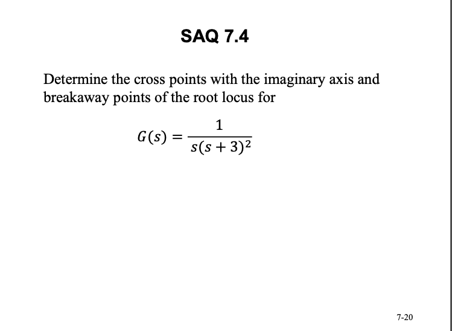

---

步骤6: 画出出发和到达的角度

不在轴上的点怎么处理？从极点出发，到达零点都有一个角度，这个角度让我们相对于实轴进行。

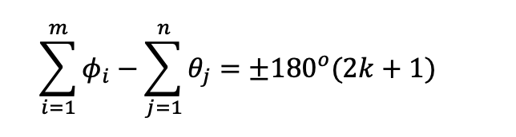

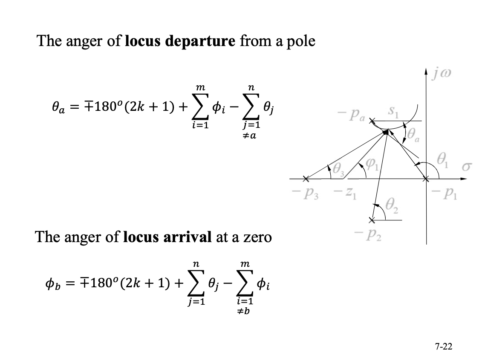

这张PPT讲的其实很清楚了，假如你是零点，就正负180度加上极点减去其他零点，然后转化到正负180度以内好画出来。

**这里有一个问题，就是180度的问题，决定了到你这来的方向，目前还没有看到讲解？**我倾向于你在虚轴上方就是加180度，在虚轴下方就是减180度

---

步骤7: 结束！

接下来是连点成线，手画或者matlab

然后是判断一个点在不在你的根轨迹上，

相位法：

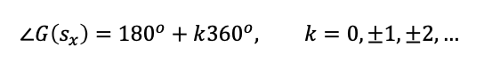

在轨迹上的点显然都满足这个条件。

**但是是不是所有满足这个条件的点都在直线上？** 我暂且认为是对的。

然后是判断你的一个点上的K值
$$
K_x = \frac{\prod^n_{i=1}|s_x+p_i|}{\prod^m_{j=1}|s_x+z_j|}
$$
注意p在上，z在下，别搞反了。K始终和极点在一个位置。

---

**特殊的根轨迹**

- arc root locus

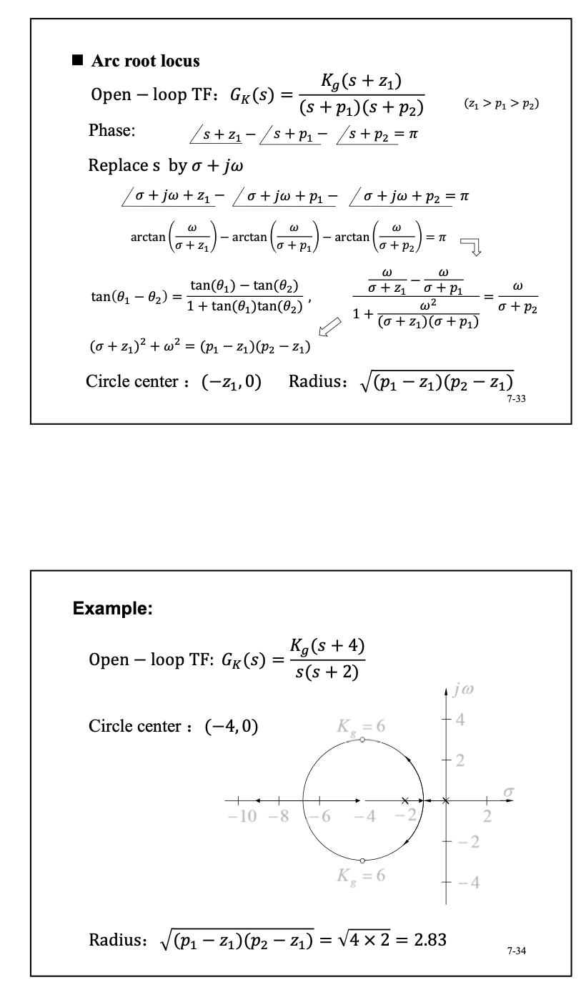

挺好玩的。

- Parametric 根轨迹

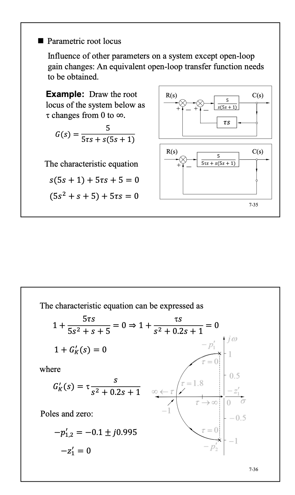

### 7.3 Properties of Root Locus

## 8 PID Control

### P control

$$
u(t) = K_pe(t)
$$

$$
M(s) = \frac{K_pG(s)}{1+K_pG(s)}
$$

注意这个e不是指数

然后

### PI controllers

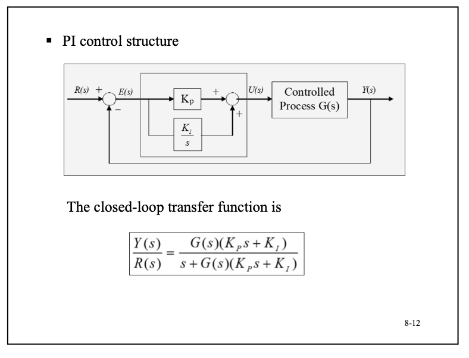

突然想到，很多时候要做到计算效果带宽有关系

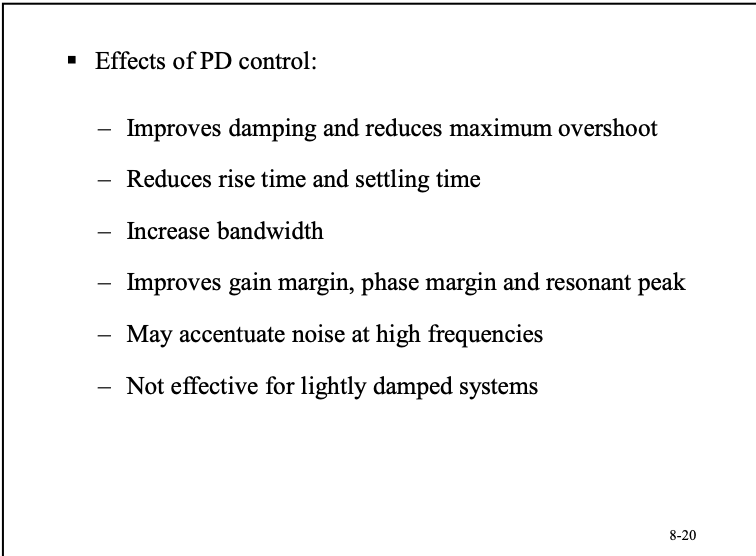

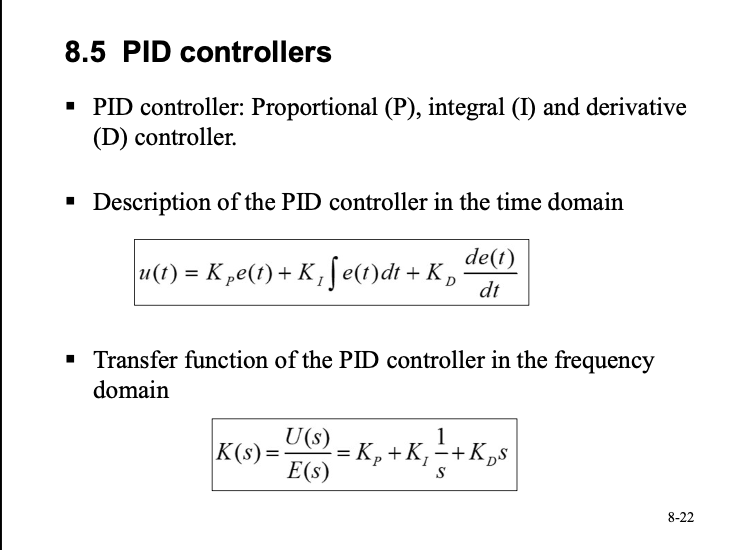

### PD Control

Ziegler-Nichols Oscillation Method

